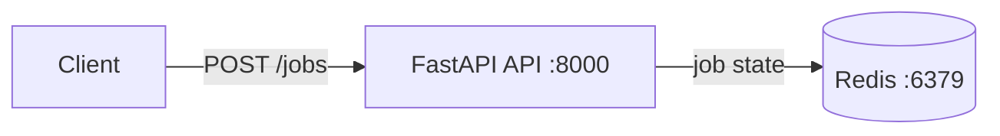

# Render Job Intake

A small HTTP service that accepts render-job requests and tracks their state in Redis. The application code and its tests are the provided starter; this repo adds the packaging and orchestration that make it runnable anywhere with a single command, plus a CI pipeline that checks it on every change.

## How to run it

You need Docker and Docker Compose. Clone the repo, then from the repo root one command brings up the API and Redis together:

```bash
docker compose up --build
```

The API is then on `http://localhost:8000`. Check it is healthy (this pings Redis):

```bash
curl localhost:8000/healthz
# {"status":"ok","redis":"ok"}
```

A `200` with `redis: ok` means the API is up and can reach Redis, so the service is ready to accept jobs (a `503` means it is running but cannot reach Redis). To create and fetch an actual job, use the **Example** under Endpoints below.

## Architecture

Clients only ever talk to the API; the API talks to Redis behind the scenes.



## Endpoints

| Method | Path             | Description                          |
|--------|------------------|--------------------------------------|
| GET    | `/healthz`       | Health check, 503 if Redis is down   |
| POST   | `/jobs`          | Create a render job                  |
| GET    | `/jobs/{job_id}` | Fetch a job by ID                    |

Example:

```bash
curl -X POST http://localhost:8000/jobs \
  -H 'Content-Type: application/json' \
  -d '{"vehicle_id":"v-42","paint_code":"BLU09","angle_degrees":45}'
```

## Configuration

| Env var          | Default     | Notes                                  |
|------------------|-------------|----------------------------------------|
| `REDIS_HOST`     | `localhost` | Set to `redis` under Compose so the API finds Redis by service name |
| `REDIS_PORT`     | `6379`      | Redis's default port |
| `REDIS_PASSWORD` | unset       | Unset for a local Redis with no auth; set it if Redis requires a password |
| `JOB_TTL_SECONDS`| `3600`      | How long a job is kept in Redis before it expires |
| `LOG_LEVEL`      | `INFO`      |  |

## Running the tests

```bash
pip install -r requirements.txt
pytest
```

Some tests need a reachable Redis and are skipped without one. CI provides a Redis service, so they run there too.

## Project layout

| Path | What it is |
|------|------------|
| `app/main.py` | The FastAPI service: the `/healthz` and `/jobs` endpoints and all Redis access |
| `app/__init__.py` | Marks `app` as a Python package |
| `tests/test_app.py` | Unit and integration tests for the endpoints |
| `requirements.txt` | Pinned Python dependencies |
| `Dockerfile` | Builds the API image (slim base, runs as a non-root user) |
| `.dockerignore` | Keeps the Docker build context small |
| `docker-compose.yml` | Runs the API and Redis together for local development |
| `.github/workflows/ci.yml` | CI pipeline: lints the Dockerfile, runs the tests, and builds and publishes the image to GHCR |

## Decisions

- **`python:3.12-slim` base image**: slim keeps it lean while staying on Debian/glibc, so dependency wheels install fast; Alpine's musl would shrink it further but often forces slow source builds.
- **Dependencies installed before the app is copied**: they go in their own layer before the code, so routine code changes reuse the cached dependency layer instead of reinstalling.
- **Published the image to GHCR, gated to `main`**: the push was optional, so I opted in; pull requests build the image to prove it compiles, and only a merge to `main` publishes a SHA-tagged image.
- **Core first, within the time box**: I prioritised a complete, tested core (containerisation, Compose, CI) over a half-finished Kubernetes stretch. Kubernetes is the next step below.

## What I would do with more time

Deliberately left as documented next steps rather than half-built. With the core in place (a containerised app, a Compose stack, and CI that publishes to GHCR), the natural progression is orchestration:

- **Deploy to Kubernetes**: a Deployment for the GHCR image with Redis in-cluster, a Service in front, and liveness/readiness probes on `/healthz`.
- **Ingress and TLS**: front the API on a real hostname with TLS rather than the locally published port.
- **ConfigMap and Secret**: move a real Redis password into a Secret and non-secret config into a ConfigMap, replacing the environment defaults.
- **A full end-to-end pipeline**: with the pieces above in place, a merge to `main` would build, publish, and deploy to the cluster automatically, closing the commit-to-production loop.
