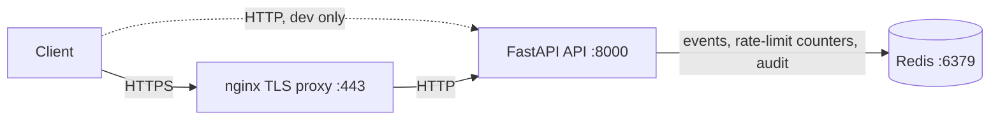
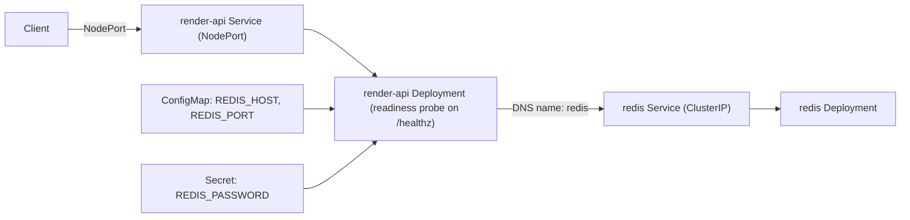

# Security Event Intake

A small HTTP service that accepts security events (a failed login, a config change, a finished scan), validates them, records them in Redis, and lets you read them back. The intake endpoint is rate limited per client, and the service keeps an audit trail of its own activity.

This began as a small FastAPI-plus-Redis starter (a render-job intake mock). I reworked the application into a security-event intake service and added everything around it: the containerisation, the Compose stack, a TLS reverse proxy, a CI pipeline, Kubernetes manifests, the rate limiting and audit features, and the tests.

## How to run it

You need Docker and Docker Compose. From the repo root, one command brings up the API, Redis, and an nginx TLS proxy together:

```bash
docker compose up --build
```

The API is reachable directly on `http://localhost:8000`, and through the nginx proxy over HTTPS on `https://localhost` (a self-signed certificate, so use `curl -k`). Check it is healthy (this pings Redis):

```bash
curl localhost:8000/healthz
# {"status":"ok","redis":"ok"}
```

A `200` with `redis: ok` means the API is up and can reach Redis (a `503` means it is running but cannot reach Redis). To submit and fetch an event, see the Example under Endpoints.

## Architecture

The service runs two ways, and the runtime shape differs slightly, so here is each. In both, Redis holds three things: the events, the rate-limit counters, and the audit log, and clients never touch Redis directly.

**Local (Docker Compose).** nginx terminates TLS and forwards to the API. The API is also published directly on port 8000 for convenience during development, so there are two ways in.



**Kubernetes.** The API is exposed through a NodePort Service and runs as a Deployment with a readiness probe on `/healthz`, so it only receives traffic once it can reach Redis. Its configuration comes from a ConfigMap (non-secret) and a Secret (the Redis password). Redis runs as its own Deployment behind a ClusterIP Service, reachable only inside the cluster.



## Endpoints

| Method | Path                 | Description                                        |
|--------|----------------------|---------------------------------------------------|
| GET    | `/healthz`           | Health check, 503 if Redis is down                |
| POST   | `/events`            | Submit a security event (rate limited)            |
| GET    | `/events/{event_id}` | Fetch an event by ID                              |
| GET    | `/audit`             | Recent audit entries (accepted and rejected)      |

An event has a `source`, an `event_type`, a `severity` (one of `low`, `medium`, `high`, `critical`), and an optional `message`. The server stamps `received_at` itself rather than trusting the client.

Example:

```bash
curl -k -X POST https://localhost/events \
  -H 'Content-Type: application/json' \
  -d '{"source":"auth-service","event_type":"failed_login","severity":"high","message":"5 failed attempts"}'
```

## Security features

**Rate limiting.** The intake endpoint is limited per client IP using a fixed-window counter stored in Redis. The counter lives in Redis rather than in application memory so the limit stays correct when the API runs as several replicas; in-memory counters would each count separately and the real limit would multiply. Over-limit callers get a `429` with a `Retry-After` header. The caller IP is read from the `X-Forwarded-For` header that the nginx proxy sets, falling back to the socket address when there is no proxy (as in the tests and the raw Kubernetes NodePort path). If Redis is unreachable the limiter fails open (allows the request) rather than taking the service down.

Its honest limits: IP rate limiting stops single-source abuse and raises the cost of the rest, but a distributed, IP-rotating attacker defeats it. It is one layer in defence in depth, not a complete defence. Per-account limits (via API keys) and upstream protection (a WAF or a CDN) would be the layers above it.

**Audit trail.** The service records its own activity to a capped Redis list: every accepted event and every rate-limited rejection, each with a timestamp and the caller IP. This is operational metadata about the API's own use, distinct from the events clients submit. `GET /audit` returns the recent entries as JSON, newest first.

Note: `/audit` exposes caller IPs and activity, so it is sensitive. It is unauthenticated here for demonstration; in a real deployment it must be behind authentication and admin-only.

## Configuration

| Env var                     | Default     | Notes                                                                 |
|-----------------------------|-------------|-----------------------------------------------------------------------|
| `REDIS_HOST`                | `localhost` | Set to `redis` under Compose and Kubernetes so the API finds Redis by service name |
| `REDIS_PORT`                | `6379`      | Redis's default port                                                  |
| `REDIS_PASSWORD`            | unset       | Unset for a local Redis with no auth; set it when Redis requires a password (as in the Kubernetes setup) |
| `EVENT_TTL_SECONDS`         | `86400`     | How long an event is kept in Redis before it expires                  |
| `RATE_LIMIT_MAX`            | `5`         | Requests allowed per window per caller. Low by default so it is easy to demonstrate; tune per environment |
| `RATE_LIMIT_WINDOW_SECONDS` | `60`        | Length of the rate-limit window                                       |
| `AUDIT_MAX_ENTRIES`         | `1000`      | The audit log is capped at this many recent entries                   |
| `LOG_LEVEL`                 | `INFO`      |                                                                       |

## Running the tests

The integration tests need a reachable Redis and skip without one, so a skipped test is not a passing test. The reliable way to run the full suite is inside a one-off container on the Compose network, with the project mounted so the tests are present:

```bash
docker compose up -d               # so Redis is running
docker compose run --rm -e REDIS_HOST=redis -v "$(pwd):/code" api pytest -v
```

All tests should pass, with the integration tests running rather than skipping. This is the same shape the CI pipeline uses: check out the code, provide a Redis service, run pytest against it.

## Running on Kubernetes

The manifests in `k8s/` run the service on a local cluster (minikube). Redis runs in-cluster with a ClusterIP Service (never exposed); the API runs behind a NodePort Service. Configuration is split into a ConfigMap (the non-secret env) and a Secret (the Redis password), and the API pod has a readiness probe on `/healthz` so it only receives traffic once it can reach Redis.

```bash
minikube start
eval $(minikube docker-env)         # build into the cluster's own Docker
docker build -t render-api:dev .
kubectl apply -f k8s/
kubectl get pods                    # both pods should reach 1/1 Running
curl $(minikube service render-api --url)/healthz
```

The Secret in `k8s/api.yaml` holds a throwaway placeholder password, not a real one. A Kubernetes Secret is base64-encoded, not encrypted, so a real deployment would inject the value from a secrets manager rather than commit it.

## Project layout

| Path | What it is |
|------|------------|
| `app/main.py` | The FastAPI service: the endpoints, Redis access, rate limiting, and the audit trail |
| `app/__init__.py` | Marks `app` as a Python package |
| `tests/test_app.py` | Unit and integration tests, including rate-limit and audit tests |
| `requirements.txt` | Pinned Python dependencies |
| `Dockerfile` | Builds the API image (slim base, runs as a non-root user) |
| `.dockerignore` | Keeps the Docker build context small |
| `docker-compose.yml` | Runs the API, Redis, and the nginx TLS proxy together for local development |
| `nginx/nginx.conf` | Reverse proxy config; terminates TLS and forwards to the API |
| `k8s/redis.yaml` | Redis Deployment and ClusterIP Service |
| `k8s/api.yaml` | API Deployment (with readiness probe), NodePort Service, ConfigMap, and Secret |
| `.github/workflows/ci.yml` | CI pipeline: lints the Dockerfile, runs the tests, and builds and publishes the image to GHCR |

## Decisions

- **`python:3.12-slim` base image**: slim keeps it lean while staying on Debian/glibc, so dependency wheels install fast; Alpine's musl would shrink it further but often forces slow source builds.
- **Dependencies installed before the app is copied**: they go in their own layer before the code, so routine code changes reuse the cached dependency layer instead of reinstalling.
- **Rate-limit counters in Redis, not memory**: keeps the limit correct across multiple API replicas, and reuses the Redis the service already depends on.
- **Server-stamped timestamps**: the service records `received_at` itself rather than trusting the client, so an event's recorded time can't be forged by the submitter.
- **ClusterIP for Redis, NodePort for the API**: the data store is sealed inside the cluster and only the front door is exposed, mirroring the intake-is-public, storage-is-private split.
- **Published the image to GHCR, gated to `main`**: pull requests build the image to prove it compiles, and only a merge to `main` publishes a SHA-tagged image.
